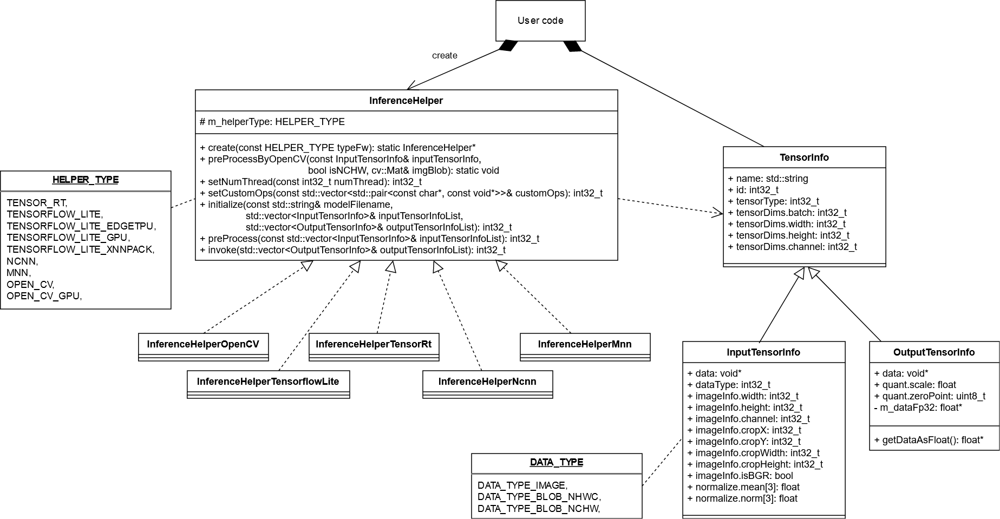

<p align="center">
  
</p>

# Inference Helper
- This is a helper class for deep learning frameworks especially for inference
- This class provides an interface to use various deep learnig frameworks, so that you can use the same application code

## Supported frameworks
- TensorFlow Lite
- TensorFlow Lite with delegate (XNNPACK, GPU, EdgeTPU, NNAPI)
- TensorRT (GPU, DLA)
- OpenCV(dnn)
- OpenCV(dnn) with GPU
- OpenVINO with OpenCV (xml+bin)
- ncnn
- ncnn with Vulkan
- MNN (with Vulkan)
- SNPE (Snapdragon Neural Processing Engine SDK (Qualcomm Neural Processing SDK for AI v1.51.0))
- Arm NN
- NNabla
- NNabla with CUDA

## Supported targets
- Windows 10 (Visual Studio 2019 x64)
- Linux (x64, armv7, aarch64)
- Android (armeabi-v7a, arm64-v8a)

## CI Status
| Framework                 | Windows (x64)                                 | Linux (x64)                                   | Linux (armv7)                                 | Linux (aarch64)                               | Android (aarch64)                              |
|---------------------------|-----------------------------------------------|-----------------------------------------------|-----------------------------------------------|-----------------------------------------------|------------------------------------------------|
|                           | [](https://github.com/iwatake2222/InferenceHelper/actions/workflows/ci_windows.yml) | [](https://github.com/iwatake2222/InferenceHelper/actions/workflows/ci_ubuntu.yml) | [](https://github.com/iwatake2222/InferenceHelper/actions/workflows/ci_arm.yml) | [](https://github.com/iwatake2222/InferenceHelper/actions/workflows/ci_arm.yml) | todo                                           |
| TensorFlow Lite           | <ul><li> [x] Build</li><li>[x] Test </li></ul>| <ul><li> [x] Build</li><li>[x] Test </li></ul>| <ul><li> [x] Build</li><li>[x] Test </li></ul>| <ul><li> [x] Build</li><li>[x] Test </li></ul>| <ul><li> [ ] Build</li><li>[ ] Test </li></ul> |
| TensorFlow Lite + XNNPACK | <ul><li> [x] Build</li><li>[x] Test </li></ul>| <ul><li> [x] Build</li><li>[x] Test </li></ul>| Unsupported                                   | <ul><li> [x] Build</li><li>[x] Test </li></ul>| <ul><li> [ ] Build</li><li>[ ] Test </li></ul> |
| TensorFlow Lite + EdgeTPU | <ul><li> [x] Build</li><li>[ ] Test </li></ul>| <ul><li> [x] Build</li><li>[ ] Test </li></ul>| <ul><li> [x] Build</li><li>[ ] Test </li></ul>| <ul><li> [x] Build</li><li>[ ] Test </li></ul>| Unsupported                                    |
| TensorFlow Lite + GPU     | Unsupported                                   | Unsupported                                   | Unsupported                                   | Unsupported                                   | <ul><li> [ ] Build</li><li>[ ] Test </li></ul> |
| TensorFlow Lite + NNAPI   | Unsupported                                   | Unsupported                                   | Unsupported                                   | Unsupported                                   | <ul><li> [ ] Build</li><li>[ ] Test </li></ul> |
| TensorRT                  | <ul><li> [ ] Build</li><li>[ ] Test </li></ul>| <ul><li> [ ] Build</li><li>[ ] Test </li></ul>| <ul><li> [ ] Build</li><li>[ ] Test </li></ul>| <ul><li> [ ] Build</li><li>[ ] Test </li></ul>| Unsupported                                    |
| OpenCV(dnn)               | <ul><li> [x] Build</li><li>[x] Test </li></ul>| <ul><li> [x] Build</li><li>[x] Test </li></ul>| <ul><li> [ ] Build</li><li>[ ] Test </li></ul>| <ul><li> [x] Build</li><li>[x] Test </li></ul>| <ul><li> [ ] Build</li><li>[ ] Test </li></ul> |
| OpenVINO with OpenCV      | <ul><li> [ ] Build</li><li>[ ] Test </li></ul>| <ul><li> [ ] Build</li><li>[ ] Test </li></ul>| <ul><li> [ ] Build</li><li>[ ] Test </li></ul>| <ul><li> [ ] Build</li><li>[ ] Test </li></ul>| Unsupported                                    |
| ncnn                      | <ul><li> [x] Build</li><li>[ ] Test </li></ul>| <ul><li> [x] Build</li><li>[x] Test </li></ul>| <ul><li> [ ] Build</li><li>[ ] Test </li></ul>| <ul><li> [ ] Build</li><li>[ ] Test </li></ul>| <ul><li> [ ] Build</li><li>[ ] Test </li></ul> |
| MNN                       | <ul><li> [x] Build</li><li>[x] Test </li></ul>| <ul><li> [x] Build</li><li>[x] Test </li></ul>| <ul><li> [ ] Build</li><li>[ ] Test </li></ul>| <ul><li> [x] Build</li><li>[x] Test </li></ul>| <ul><li> [ ] Build</li><li>[ ] Test </li></ul> |
| SNPE                      | Unsupported                                   | Unsupported                                   | <ul><li> [ ] Build</li><li>[ ] Test </li></ul>| <ul><li> [ ] Build</li><li>[ ] Test </li></ul>| <ul><li> [ ] Build</li><li>[ ] Test </li></ul> |
| Arm NN                    | Unsupported                                   | <ul><li> [x] Build</li><li>[x] Test </li></ul>| Unsupported                                   | <ul><li> [x] Build</li><li>[x] Test </li></ul>| Unsupported                                    |
| NNabla                    | <ul><li> [x] Build</li><li>[x] Test </li></ul>| <ul><li> [ ] Build</li><li>[ ] Test </li></ul>| Unsupported                                   | <ul><li> [ ] Build</li><li>[ ] Test </li></ul>| Unsupported                                    |
| NNabla + CUDA             | <ul><li> [ ] Build</li><li>[ ] Test </li></ul>| <ul><li> [ ] Build</li><li>[ ] Test </li></ul>| Unsupported                                   | <ul><li> [ ] Build</li><li>[ ] Test </li></ul>| Unsupported                                    |

* Unchedked(blank) doesn't mean that the framework is unsupported. Unchecked just means that the framework is not tested in CI. For instance, TensorRT on Windows/Linux works and I confirmed it in my PC, but can't run it in CI. Also, some build/test (e.g. ncnn + Linux+ARM) are skipped because pre-built libraries are not provided. It should work if you build a library by yourself.

## Sample projects
- https://github.com/iwatake2222/InferenceHelper_Sample
- https://github.com/iwatake2222/play_with_tflite
- https://github.com/iwatake2222/play_with_tensorrt
- https://github.com/iwatake2222/play_with_ncnn
- https://github.com/iwatake2222/play_with_mnn

# Usage
Please refer to https://github.com/iwatake2222/InferenceHelper_Sample

## Installation
- Add this repository into your project (Using `git submodule` is recommended)
- Download prebuilt libraries
    - `sh third_party/download_prebuilt_libraries.sh`

## Extra steps
You need some extra steps if you use the frameworks listed below

### Extra steps: OpenCV / OpenVINO
- Install OpenCV or OpenVINO
    - You may need to set/modify `OpenCV_DIR` and `PATH` environment variable
    - To use OpenVINO, you may need to run `C:\Program Files (x86)\Intel\openvino_2021\bin\setupvars.bat` or `source /opt/intel/openvino_2021/bin/setupvars.sh`

### Extra steps: Tensorflow Lite (EdgeTPU)
- Install the following library
    - Linux: https://github.com/google-coral/libedgetpu/releases/download/release-grouper/edgetpu_runtime_20210726.zip
    - Windows: https://github.com/google-coral/libedgetpu/releases/download/release-frogfish/edgetpu_runtime_20210119.zip
        - the latest version doesn't work
        - it may be better to delete `C:\Windows\System32\edgetpu.dll` to ensure the program uses our pre-built library

### Extra steps: ncnn
- Install Vulkan
    - You need Vulkan even if you don't use it because the pre-built libraries require it. Otherwise you need to build libraries by yourself disabling Vulkan
    - https://vulkan.lunarg.com/sdk/home
    - Windows
        - https://sdk.lunarg.com/sdk/download/latest/windows/vulkan-sdk.exe
        - It's better to check `(Optional) Debuggable Shader API Libraries -64-bit` , so that you can use Debug in Visual Studio
    - Linux (x64)
        ```sh
        wget https://sdk.lunarg.com/sdk/download/latest/linux/vulkan-sdk.tar.gz
        tar xzvf vulkan-sdk.tar.gz
        export VULKAN_SDK=$(pwd)/1.2.198.1/x86_64
        sudo apt install -y vulkan-utils libvulkan1 libvulkan-dev
        ```

### Extra steps: SNPE
- Download library from https://developer.qualcomm.com/software/qualcomm-neural-processing-sdk/tools
- Extract `snpe-1.51.0.zip` , then place `lib` and `include` folders to `third_party/snpe_prebuilt`

### Note:
- `Debug` mode in Visual Studio doesn't work for ncnn and NNabla because debuggable libraries are not provided
- See `third_party/download_prebuilt_libraries.sh` and `third_party/cmakes/*` to check which libraries are being used. For instance, libraries without GPU(CUDA/Vulkan) are used to be safe. So, if you want to use GPU, modify these files.

## Project settings in CMake
- Add InferenceHelper to your project
    ```cmake
    set(INFERENCE_HELPER_DIR ${CMAKE_CURRENT_LIST_DIR}/../../InferenceHelper/)
    add_subdirectory(${INFERENCE_HELPER_DIR}/inference_helper inference_helper)
    target_include_directories(${LibraryName} PUBLIC ${INFERENCE_HELPER_DIR}/inference_helper)
    target_link_libraries(${LibraryName} InferenceHelper)
    ```

## CMake options
- Deep learning framework:
    - You can enable multiple options althoguh the following example enables just one option

    ```sh
    # OpenCV (dnn), OpenVINO
    cmake .. -DINFERENCE_HELPER_ENABLE_OPENCV=on
    # Tensorflow Lite
    cmake .. -DINFERENCE_HELPER_ENABLE_TFLITE=on
    # Tensorflow Lite (XNNPACK)
    cmake .. -DINFERENCE_HELPER_ENABLE_TFLITE_DELEGATE_XNNPACK=on
    # Tensorflow Lite (GPU)
    cmake .. -DINFERENCE_HELPER_ENABLE_TFLITE_DELEGATE_GPU=on
    # Tensorflow Lite (EdgeTPU)
    cmake .. -DINFERENCE_HELPER_ENABLE_TFLITE_DELEGATE_EDGETPU=on
    # Tensorflow Lite (NNAPI)
    cmake .. -DINFERENCE_HELPER_ENABLE_TFLITE_DELEGATE_NNAPI=on
    # TensorRT
    cmake .. -DINFERENCE_HELPER_ENABLE_TENSORRT=on
    # ncnn, ncnn + vulkan
    cmake .. -DINFERENCE_HELPER_ENABLE_NCNN=on
    # MNN (+ Vulkan)
    cmake .. -DINFERENCE_HELPER_ENABLE_MNN=on
    # SNPE
    cmake .. -DINFERENCE_HELPER_ENABLE_SNPE=on
    # Arm NN
    cmake .. -DINFERENCE_HELPER_ENABLE_ARMNN=on
    # NNabla
    cmake .. -DINFERENCE_HELPER_ENABLE_NNABLA=on
    # NNabla with CUDA
    cmake .. -DINFERENCE_HELPER_ENABLE_NNABLA_CUDA=on
    ```

- Enable/Disable preprocess using OpenCV:
    - By disabling this option, InferenceHelper is not dependent on OpenCV
    ```sh
    cmake .. -INFERENCE_HELPER_ENABLE_PRE_PROCESS_BY_OPENCV=off
    ```

# Structure
 

# APIs
## InferenceHelper
### Enumeration
```c++
typedef enum {
    kOpencv,
    kOpencvGpu,
    kTensorflowLite,
    kTensorflowLiteXnnpack,
    kTensorflowLiteGpu,
    kTensorflowLiteEdgetpu,
    kTensorflowLiteNnapi,
    kTensorrt,
    kNcnn,
    kNcnnVulkan,
    kMnn,
    kSnpe,
    kArmnn,
    kNnabla,
    kNnablaCuda,
} HelperType;
```

### static InferenceHelper* Create(const HelperType helper_type)
- Create InferenceHelper instance for the selected framework

```c++
std::unique_ptr<InferenceHelper> inference_helper(InferenceHelper::Create(InferenceHelper::kTensorflowLite));
```

### static void PreProcessByOpenCV(const InputTensorInfo& input_tensor_info, bool is_nchw, cv::Mat& img_blob)
- Run preprocess (convert image to blob(NCHW or NHWC))
- This is just a helper function. You may not use this function.
    - Available when `INFERENCE_HELPER_ENABLE_PRE_PROCESS_BY_OPENCV=on`

```c++
InferenceHelper::PreProcessByOpenCV(input_tensor_info, false, img_blob);
```

### int32_t SetNumThreads(const int32_t num_threads)
- Set the number of threads to be used
- This function needs to be called before initialize

```c++
inference_helper->SetNumThreads(4);
```

### int32_t SetCustomOps(const std::vector<std::pair<const char*, const void*>>& custom_ops)
- Set custom ops
- This function needs to be called before initialize

```c++
std::vector<std::pair<const char*, const void*>> custom_ops;
custom_ops.push_back(std::pair<const char*, const void*>("Convolution2DTransposeBias", (const void*)mediapipe::tflite_operations::RegisterConvolution2DTransposeBias()));
inference_helper->SetCustomOps(custom_ops);
```

### int32_t Initialize(const std::string& model_filename, std::vector<InputTensorInfo>& input_tensor_info_list, std::vector<OutputTensorInfo>& output_tensor_info_list)
- Initialize inference helper
    - Load model
    - Set tensor information

```c++
std::vector<InputTensorInfo> input_tensor_list;
InputTensorInfo input_tensor_info("input", TensorInfo::TENSOR_TYPE_FP32, false);    /* name, data_type, NCHW or NHWC */
input_tensor_info.tensor_dims = { 1, 224, 224, 3 };
input_tensor_info.data_type = InputTensorInfo::kDataTypeImage;
input_tensor_info.data = img_src.data;
input_tensor_info.image_info.width = img_src.cols;
input_tensor_info.image_info.height = img_src.rows;
input_tensor_info.image_info.channel = img_src.channels();
input_tensor_info.image_info.crop_x = 0;
input_tensor_info.image_info.crop_y = 0;
input_tensor_info.image_info.crop_width = img_src.cols;
input_tensor_info.image_info.crop_height = img_src.rows;
input_tensor_info.image_info.is_bgr = false;
input_tensor_info.image_info.swap_color = false;
input_tensor_info.normalize.mean[0] = 0.485f;   /* https://github.com/onnx/models/tree/master/vision/classification/mobilenet#preprocessing */
input_tensor_info.normalize.mean[1] = 0.456f;
input_tensor_info.normalize.mean[2] = 0.406f;
input_tensor_info.normalize.norm[0] = 0.229f;
input_tensor_info.normalize.norm[1] = 0.224f;
input_tensor_info.normalize.norm[2] = 0.225f;
input_tensor_list.push_back(input_tensor_info);

std::vector<OutputTensorInfo> output_tensor_list;
output_tensor_list.push_back(OutputTensorInfo("MobilenetV2/Predictions/Reshape_1", TensorInfo::TENSOR_TYPE_FP32));

inference_helper->initialize("mobilenet_v2_1.0_224.tflite", input_tensor_list, output_tensor_list);
```

### int32_t Finalize(void)
- Finalize inference helper

```c++
inference_helper->Finalize();
```

### int32_t PreProcess(const std::vector<InputTensorInfo>& input_tensor_info_list)
- Run preprocess
- Call this function before invoke
- Call this function even if the input data is already pre-processed in order to copy data to memory
- **Note** : Some frameworks don't support crop, resize. So, it's better to resize image before calling preProcess.

```c++
inference_helper->PreProcess(input_tensor_list);
```

### int32_t Process(std::vector<OutputTensorInfo>& output_tensor_info_list)
- Run inference

```c++
inference_helper->Process(output_tensor_info_list)
```

## TensorInfo (InputTensorInfo, OutputTensorInfo)
### Enumeration
```c++
enum {
    kTensorTypeNone,
    kTensorTypeUint8,
    kTensorTypeInt8,
    kTensorTypeFp32,
    kTensorTypeInt32,
    kTensorTypeInt64,
};
```

### Properties
```c++
std::string name;           // [In] Set the name_ of tensor
int32_t     id;             // [Out] Do not modify (Used in InferenceHelper)
int32_t     tensor_type;    // [In] The type of tensor (e.g. kTensorTypeFp32)
std::vector<int32_t> tensor_dims;    // InputTensorInfo:   [In] The dimentions of tensor. (If empty at initialize, the size is updated from model info.)
                                     // OutputTensorInfo: [Out] The dimentions of tensor is set from model information
bool        is_nchw;        // [IN] NCHW or NHWC

```

## InputTensorInfo
### Enumeration
```c++
enum {
    kDataTypeImage,
    kDataTypeBlobNhwc,  // data_ which already finished preprocess(color conversion, resize, normalize_, etc.)
    kDataTypeBlobNchw,
};
```

### Properties
```c++
void*   data;      // [In] Set the pointer to image/blob
int32_t data_type; // [In] Set the type of data_ (e.g. kDataTypeImage)

struct {
    int32_t width;
    int32_t height;
    int32_t channel;
    int32_t crop_x;
    int32_t crop_y;
    int32_t crop_width;
    int32_t crop_height;
    bool    is_bgr;        // used when channel == 3 (true: BGR, false: RGB)
    bool    swap_color;
} image_info;              // [In] used when data_type_ == kDataTypeImage

struct {
    float mean[3];
    float norm[3];
} normalize;              // [In] used when data_type_ == kDataTypeImage
```


## OutputTensorInfo
### Properties
```c++
void* data;     // [Out] Pointer to the output data_
struct {
    float   scale;
    uint8_t zero_point;
} quant;        // [Out] Parameters for dequantization (convert uint8 to float)
```

### float* GetDataAsFloat()
- Get output data in the form of FP32
- When tensor type is INT8 (quantized), the data is converted to FP32 (dequantized)

```c++
const float* val_float = output_tensor_list[0].GetDataAsFloat();
```

# License
- InferenceHelper
- https://github.com/iwatake2222/InferenceHelper
- Copyright 2020 iwatake2222
- Licensed under the Apache License, Version 2.0

# Acknowledgements
- This project utilizes OSS (Open Source Software)
    - [NOTICE.md](NOTICE.md)
